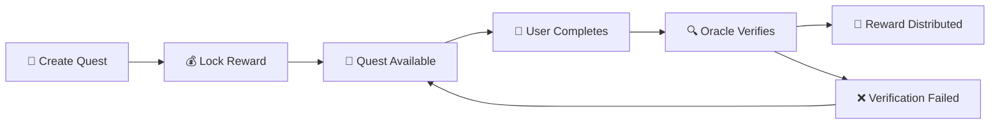

# ⚔️ Skill Verified Quest Rewards

🎮 **A gamified blockchain quest system** built on Stacks that rewards skill-based achievements through oracle verification. Create quests, complete challenges, earn STX rewards! 💰

[]()
[]()
[]()

## ✨ What is this?

🏆 **Skill Verified Quest Rewards** transforms learning and skill development into an exciting, reward-driven adventure! Users create skill-based challenges, participants complete them, and trusted oracles verify achievements before distributing STX rewards.

### 🌟 Perfect for:
- 📚 **Educational platforms** - Reward course completions
- 💻 **Developer communities** - Incentivize contributions
- 🎨 **Creative challenges** - Showcase talents
- 🏅 **Skill competitions** - Gamify learning

## 🚀 Features

| Feature | Description | Status |
|---------|-------------|--------|
| 🎯 **Quest Creation** | Create custom skill-based quests with STX rewards | ✅ |
| 🔍 **Oracle Verification** | Trusted verification system for quest completion | ✅ |
| 💎 **Automatic Rewards** | Smart contract handles STX distribution | ✅ |
| 📊 **User Statistics** | Track achievements and total rewards earned | ✅ |
| 🛡️ **Access Control** | Secure oracle management system | ✅ |
| ⏰ **Quest Expiration** | Time-limited challenges for urgency | ✅ |
| 🔒 **Fund Protection** | Quest creators can reclaim unused funds | ✅ |

## 🏗️ Quick Start

### 📋 Prerequisites
- 🟢 [Node.js](https://nodejs.org/) v18+ 
- ⚡ [Clarinet CLI](https://docs.hiro.so/clarinet) installed
- 💰 STX tokens for testing

### 🚀 Installation

```bash
# 1️⃣ Clone the repository
git clone https://github.com/your-username/skill-verified-quest-rewards.git
cd skill-verified-quest-rewards

# 2️⃣ Install dependencies
npm install

# 3️⃣ Run tests to verify setup
npm test

# 4️⃣ Start developing! 🎉
npm run test:watch
```

### ⚡ Quick Test

```bash
# Ensure everything works
npm run test:report
```

You should see: ✅ **1 passed** - You're ready to go! 🎊

## 🎮 How It Works

### 🔄 Quest Lifecycle



1. **🎯 Quest Creation**: Anyone can create a quest with STX rewards
2. **📝 Participation**: Users complete quest requirements
3. **🔍 Verification**: Authorized oracles verify completions
4. **💰 Reward**: Verified participants receive STX automatically!

## 📚 Smart Contract API

### 🔧 Public Functions

| Function | Description | Parameters |
|----------|-------------|------------|
| `create-quest` | 🎯 Create new quest | title, description, reward, duration, oracle, skill-type |
| `complete-quest` | ✅ Mark quest completed | quest-id |
| `verify-completion` | 🔍 Oracle verifies completion | quest-id, participant |
| `authorize-oracle` | 👑 Add trusted oracle (owner only) | oracle-principal |
| `revoke-oracle` | ❌ Remove oracle (owner only) | oracle-principal |
| `deactivate-quest` | 🛑 Cancel quest & refund | quest-id |

### 📖 Read-Only Functions

| Function | Returns | Description |
|----------|---------|-------------|
| `get-quest` | Quest details | 📋 Full quest information |
| `get-quest-completion` | Completion status | ✅ User's completion status |
| `get-user-stats` | User statistics | 📊 Completed quests & rewards |
| `is-oracle-authorized` | Boolean | 🔍 Check oracle authorization |
| `get-active-quests-count` | Number | 📈 Total active quests |
| `can-complete-quest` | Boolean | ❓ Check if user can complete quest |

## 💡 Usage Examples

### 🎯 Creating Your First Quest

```javascript
// 🎮 Game Development Challenge
const questResult = simnet.callPublicFn(
  "skill-verified-quest-rewards",
  "create-quest",
  [
    Cl.stringAscii("🎮 Build a Web3 Game"),           // Title
    Cl.stringAscii("Create a simple blockchain game using Clarity"), // Description
    Cl.uint(5000000),      // 💰 5 STX reward
    Cl.uint(1008),         // ⏰ 7 days (144 blocks/day)
    Cl.principal("ST1ORACLE..."), // 🔍 Trusted oracle
    Cl.stringAscii("game-dev")     // 🏷️ Skill category
  ],
  creatorWallet
);
```

### ✅ Completing a Quest

```javascript
// 🏃‍♂️ Participant completes the challenge
const completion = simnet.callPublicFn(
  "skill-verified-quest-rewards",
  "complete-quest",
  [Cl.uint(1)], // Quest ID
  participantWallet
);
```

### 🔍 Oracle Verification & Reward Distribution

```javascript
// 🎉 Oracle verifies and triggers reward
const verification = simnet.callPublicFn(
  "skill-verified-quest-rewards",
  "verify-completion",
  [
    Cl.uint(1), // Quest ID
    Cl.principal("ST1PARTICIPANT...") // Participant address
  ],
  oracleWallet // 🔑 Only authorized oracles
);
// 💰 STX automatically sent to participant!
```

## 🛡️ Security & Trust

### 🔒 Built-in Protections

- ✅ **Oracle Authorization**: Only contract owner can authorize oracles
- 🕐 **Time Limits**: Quests expire to prevent indefinite locks
- 🚫 **Duplicate Prevention**: Users can't complete same quest twice
- 💰 **Fund Recovery**: Quest creators can reclaim unused rewards
- 🔍 **Verification Required**: No rewards without oracle confirmation

### 🚨 Error Handling

| Error Code | Meaning | Solution |
|------------|---------|----------|
| `u100` | 🚫 Not authorized | Check permissions |
| `u101` | ❓ Quest not found | Verify quest ID |
| `u102` | ⏰ Quest expired | Quest deadline passed |
| `u103` | ✅ Already completed | User already finished this quest |
| `u104` | 💸 Insufficient funds | Add more STX to wallet |
| `u105` | 🔍 Invalid oracle | Oracle not authorized |
| `u106` | 🛑 Quest inactive | Quest was deactivated |
| `u107` | 💰 Invalid reward | Reward amount must be > 0 |

## 🧪 Testing & Development

### 🔬 Available Commands

```bash
# 🧪 Run all tests
npm test

# 📊 Generate coverage report
npm run test:report

# 👀 Watch mode for development
npm run test:watch

# 🔧 TypeScript type checking
npx tsc --noEmit

# 🔍 Contract syntax check
clarinet check
```

### 🛠️ Adding New Features

1. **📝 Write Tests First**
   ```typescript
   describe("🎯 New Feature", () => {
     it("should work perfectly 💪", () => {
       // Your test here
       expect(result).toBeOk();
     });
   });
   ```

2. **⚡ Implement in Contract**
   - Edit `contracts/skill-verified-quest-rewards.clar`
   - Follow existing patterns
   - Add proper error handling

3. **✅ Verify Everything Works**
   ```bash
   npm test && npm run test:report
   ```

## 📊 Project Structure

```
🏗️ skill-verified-quest-rewards/
├── 📁 contracts/
│   └── 📜 skill-verified-quest-rewards.clar    # 🧠 Smart contract brain
├── 🧪 tests/
│   └── 📋 skill-verified-quest-rewards.test.ts  # 🔬 Test suite
├── ⚙️ settings/
│   ├── 🌐 Devnet.toml                          # Development config
│   └── 🎮 Simnet.toml                          # Simulation config
├── 📦 package.json                              # Dependencies
├── 🔧 Clarinet.toml                             # Clarinet config
├── 📝 tsconfig.json                             # TypeScript config
├── 🧪 vitest.config.js                          # Test config
└── 📖 README.md                                 # You are here! 👋
```

## 🤝 Contributing

🎉 **We love contributors!** Here's how to get involved:

1. 🍴 **Fork** this repository
2. 🌟 **Create** a feature branch: `git checkout -b amazing-feature`
3. ✨ **Make** your changes
4. 🧪 **Test** everything: `npm test`
5. 💌 **Submit** a pull request

### 🏆 Contribution Ideas
- 📈 **Quest Analytics Dashboard**
- 🏅 **Achievement Badges System**
- 🔔 **Real-time Notifications**
- 🎨 **Frontend Interface**
- 📱 **Mobile Integration**

## 🌐 Deployment

### 🚀 Deploy to Testnet

```bash
# 1️⃣ Configure your testnet wallet
clarinet deployments generate --testnet

# 2️⃣ Deploy the contract
clarinet deployments apply --testnet
```

### 🎯 Deploy to Mainnet

```bash
# 🚨 Make sure you're ready for production!
clarinet deployments generate --mainnet
clarinet deployments apply --mainnet
```

## 🔗 Resources & Links

- 📚 [Stacks Documentation](https://docs.stacks.co/)
- 🔧 [Clarity Language Reference](https://book.clarity-lang.org/)
- ⚡ [Clarinet Documentation](https://docs.hiro.so/clarinet)
- 🧪 [Vitest Testing Framework](https://vitest.dev/)
- 🎮 [Web3 Gaming Resources](https://stacks.org/)

## 📄 License

ISC License - feel free to use this in your own projects! 🎉

## 🎊 Acknowledgments

- 🙏 **Stacks Foundation** for the amazing blockchain
- 💪 **Hiro Systems** for Clarinet and developer tools
- 🌟 **Open Source Community** for inspiration
- ☕ **Coffee** for fuel during development

---

<div align="center">

### 🚀 Ready to gamify your skills? Let's build something amazing! 🎮

**Star ⭐ this repo if you found it helpful!**

*Built with ❤️ and ☕ by the community*

</div>

# 🎯 Skill-Verified Quest Rewards

> A decentralized quest system where users complete skill-based challenges verified by trusted oracles and earn STX rewards! 🚀

## 📋 Overview

The Skill-Verified Quest Rewards system allows quest creators to set up skill-based challenges that participants can complete to earn cryptocurrency rewards. Each quest completion must be verified by authorized oracles before rewards are distributed, ensuring genuine skill demonstration.

## ✨ Features

- 🎮 **Quest Creation**: Anyone can create quests with custom rewards and skill requirements
- 🔍 **Oracle Verification**: Trusted oracles verify quest completions before reward distribution
- 💰 **Automatic Rewards**: STX tokens are automatically transferred upon verification
- 📊 **User Statistics**: Track completed quests and total rewards earned
- ⏰ **Quest Expiration**: Time-limited quests with automatic expiry
- 🛡️ **Security**: Authorization checks and fund escrow for quest creators

## 🏗️ Contract Architecture

### Core Data Structures

- **Quests**: Store quest details, rewards, oracles, and expiry information
- **Quest Completions**: Track participant progress and verification status
- **User Stats**: Aggregate user achievements and rewards
- **Authorized Oracles**: Manage trusted verification providers

### Key Functions

#### 🎯 Quest Management
- `create-quest`: Create new skill-based quests with reward escrow
- `deactivate-quest`: Cancel active quests and refund creators
- `complete-quest`: Mark quest as completed by participant

#### ✅ Verification System  
- `verify-completion`: Oracle verifies and triggers reward distribution
- `authorize-oracle`: Add trusted oracle providers
- `revoke-oracle`: Remove oracle authorization

#### 📊 Query Functions
- `get-quest`: Retrieve quest details
- `get-user-stats`: View user achievements
- `can-complete-quest`: Check quest eligibility

## 🚀 Getting Started

### Prerequisites
- Clarinet CLI installed
- Stacks wallet for testing
- Basic understanding of Clarity smart contracts

### Installation

1. Clone this repository:
```bash
git clone https://github.com/yourusername/skill-verified-quest-rewards.git
cd skill-verified-quest-rewards
```

2. Deploy the contract:
```bash
clarinet deploy
```

### 💡 Usage Examples

#### Creating a Quest
```clarity
(contract-call? .quest-rewards create-quest
  "JavaScript Coding Challenge"
  "Build a working React component with specific requirements"
  u1000000  ;; 1 STX reward
  u144      ;; 1 day duration (144 blocks)
  'SP2J6ZY48GV1EZ5V2V5RB9MP66SW86PYKKNRV9EJ7 ;; oracle address
  "web-development"
)
```

#### Completing a Quest
```clarity
(contract-call? .quest-rewards complete-quest u1)
```

#### Oracle Verification
```clarity
(contract-call? .quest-rewards verify-completion 
  u1 ;; quest-id
  'SP3FBR2AGK5H9QBDH3EEN6DF8EK8JY7RX8QJ5SVTE ;; participant
)
```

## 🎮 Workflow

1. **📝 Quest Creation**: Creator deposits STX and defines quest parameters
2. **🏃 Participation**: Users register completion of quest requirements  
3. **🔍 Oracle Review**: Authorized oracle evaluates the submission
4. **✅ Verification**: Oracle confirms completion and triggers reward transfer
5. **💰 Reward Distribution**: STX automatically sent to participant
6. **📈 Stats Update**: User achievements updated on-chain

## 🔐 Security Features

- **💳 Escrow System**: Quest rewards locked in contract until verification
- **👥 Oracle Authorization**: Only approved oracles can verify completions
- **⏱️ Time Limits**: Automatic quest expiry prevents indefinite locks
- **🔒 Access Control**: Quest creators can only modify their own quests
- **💼 Fund Protection**: Comprehensive error handling and validation

## 🛠️ Error Codes

| Code | Description |
|------|-------------|
| `u100` | Not authorized |
| `u101` | Quest not found |
| `u102` | Quest expired |
| `u103` | Already completed |
| `u104` | Insufficient funds |
| `u105` | Invalid oracle |
| `u106` | Quest inactive |
| `u107` | Invalid reward amount |

## 🧪 Testing

Run the test suite:
```bash
clarinet test
```

Check contract syntax:
```bash
clarinet check
```

## 📈 Future Enhancements

- 🏆 **Quest Categories**: Skill-specific quest filtering
- 🌟 **Reputation System**: Oracle and participant scoring
- 🎁 **NFT Rewards**: Custom token rewards beyond STX
- 📱 **Multi-Oracle**: Require multiple oracle confirmations
- 🔄 **Quest Templates**: Reusable quest patterns

## 🤝 Contributing

We welcome contributions! Please feel free to submit pull requests or create issues for bugs and feature requests.

## 📄 License

This project is licensed under the MIT License - see the [LICENSE](LICENSE) file for details.

## 🙋‍♀️ Support

For questions and support, please open an issue in this repository or reach out to the development team.

---

*Built with ❤️ using Clarity and the Stacks blockchain*

# Skill-Verified Quest Rewards

